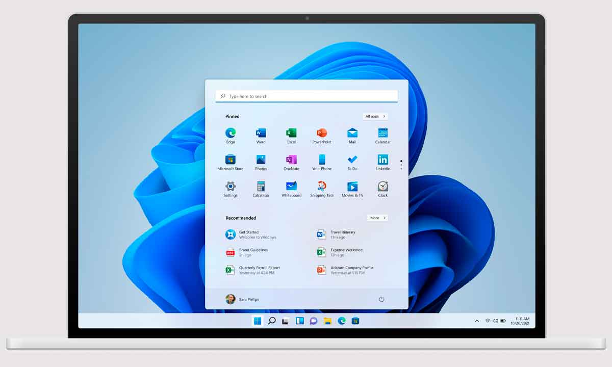
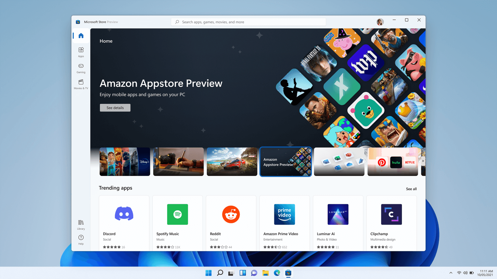
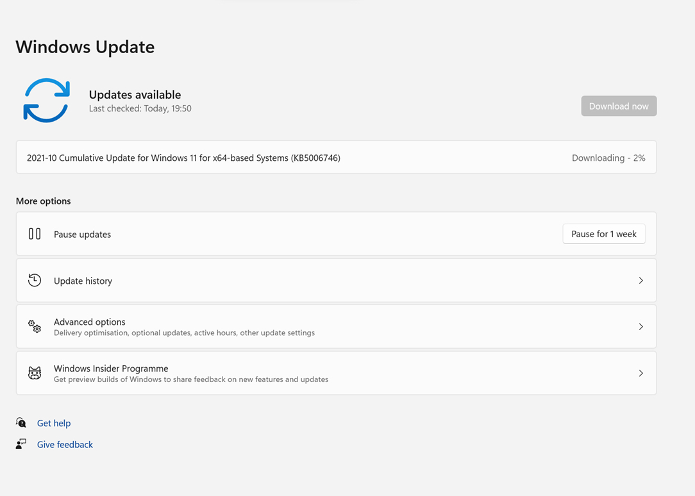
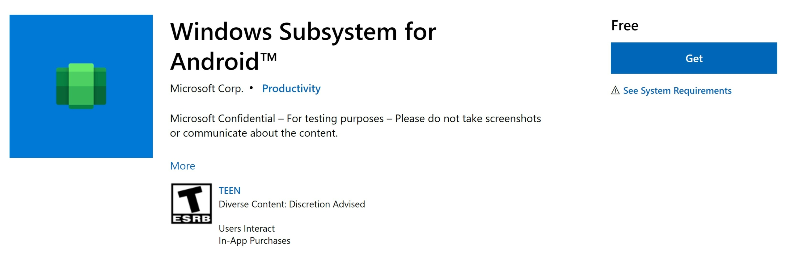
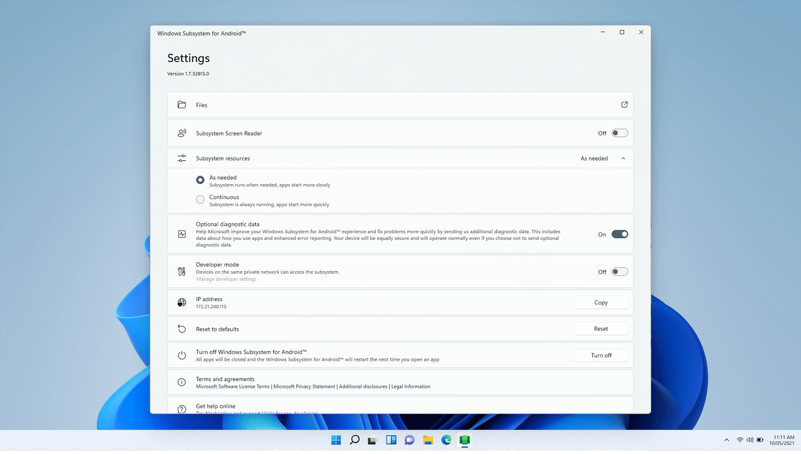

# Utilizando el Windows Subsystem para Android para desarrollar

Si has desarrollado con .NET y Xamarin en los últimos años recordarás la evolución al trabajar con emuladores Android. El paso de los emuladores por defecto a Intel HAXM fue un gran paso adelante en el rendimiento general; luego pasamos a tener más opciones como Xamarin Android Player para finalmente llegar al soporte de Hyper-V lo que facilitó otro salto en rendimiento y tiempo de arranque.

 _¿Y si estamos ante el siguiente salto?_. En este artículo, vamos a conocer el **Windows Subsystem para Android** así como lo necesario para utilizarlo para desarrollar y depurar aplicaciones Android.

## Windows 11

Entre las novedades de Windows 11 nos llega un subsistema de Android. 



El objetivo principal es el permitir ejecutar aplicaciones Android en Windows. No existe un launcher Android o similar, Windows es directamente quien se encarga de lanzar las Apps.



Como usuarios, aunque no es la única vía, se pueden obtener aplicaciones Android desde la Store utilizando la Amazon App Store.

## Instalar el subsistema de Android en Windows 11

Lo primero que debemos hacer es tener una build de Windows Insiders Beta (al momento de escribir este artículo) que coincida con **Windows 11 Build 22000.xxx**.



Tras tener esta versión de Windows es hora de instalar el Windows Subsystem for Android que tambien viene con la Amazon App Store.

Este paso es sencillo, solo hay que entrar en la Store, instalar y reiniciar.



## Hora de desarrollar!

Dentro del WSA App encontrarás bastantes opciones.



Necesitamos cambiar varias opciones:
* Habilitar el modo **Continuous** para que el subsistema siempre este listo para ser usado.
* Activar el **modo de desarrollador**.

**NOTA:** Al activar el modo de desarrollador veremos las instrucciones necesarias para conectar por adb.

Con el subsistema Windows para Android en ejecución podemos usar **127.0.0.1:58526** para conectar y hacer debugging.

```
adb connect 127.0.0.1:58526
```

**NOTA:** Lo visto anterior es la forma por defecto para conectar con WSA pero puedes encontrar más opciones en la documentación oficial.

Una vez conectado vía adb, sencillamente aparecerá la opción de WSA en Visual Studio.


## Más información 

 * Microsoft Documentation: [Windows Subsystem for Android](https://docs.microsoft.com/en-us/windows/android/wsa/)