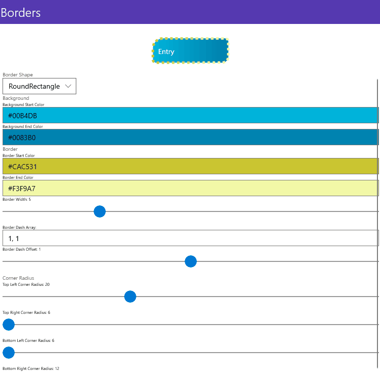

# Bordes personalizados en .NET MAUI

Aplicar bordes personalizados es una necesidad bastante común utilizada en el diseño de aplicaciones para crear estructuras visuales concretas, resaltar elementos o poder personalizar ciertos controles específicos.

En Xamarin.Forms el control **Frame** ha sido ampliamente utilizado con este fin. Sin embargo, el control Frame contaba con ciertas limitaciones:
- No poder personalizar cada esquina del borde.
- No poder personalizar el ancho del borde.
- No poder utilizar brushes en el propio borde.
- Etc.

Con la Preview 9 de .NET MAUI llega un nuevo control, Border, con bastantes más posibilidades y con el objetivo de resolver todas las limitaciones que teníamos hasta ahora. _¿Lo revisamos en este artículo?_.

## Nuevo control Border

El nuevo control Border, similar en concepto al Frame, es un control que permite un único elemento como contenido pero que puede ser cualquier cosa. Es decir, podremos aplicar un Border desde a un sencillo Label a un Grid con un layout complejo.

```
<Border Stroke="Red" StrokeThickness="2">
    <Border.ShapeBorder>
        <RoundRectangle CornerRadius="12, 0, 0, 24" />
    </Border.ShapeBorder>
    <Label Text="Border" />
</Border>
```

El control Border cuenta con diferentes propiedades para personalizar el borde:
* **Stroke**: Brush que define el color o **gradiente** a utilizar en el borde.
* **StrokeThickness**: Grosor del borde.
* **StrokeDashArray**: Se utiliza una colección de valores Double que indican el patrón Dash y los espacios que se usan para delinear la figura a utilizar en el borde.
* **StrokeDashOffset**: Es un valor de tipo Double que indica la distancia a usar en el patrón Dash desde donde comienza.
* **StrokeLineJoin**: Especifica como se realizará la unión entre los vértices de la figura a utilizar en el borde.
* **StrokeLineCap**: Especifica como es el trazo del inicio y fin de la figura a utilizar en el borde.

Y entre las propiedades disponibles me gustaría destacar, **StrokeShape**. Espera un Shape que define la forma del borde. Por defecto se usa un Rectángulo pero puede ser desde un Rectángulo con bordes redondeados a cualquier figura.

Podemos pasar de un borde con forma rectangular y bordes redondeados personalizados:

```
<Border Stroke="Red" StrokeThickness="2">
    <Border.ShapeBorder>
        <RoundRectangle CornerRadius="12, 0, 0, 24" />
    </Border.ShapeBorder>
    <Label Text="Border" />
</Border>
```

A una elipse:

```
<Border Stroke="Red" StrokeThickness="2">
    <Border.ShapeBorder>
        <Ellipse />
    </Border.ShapeBorder>
    <Label Text="Border" />
</Border>
```

A continuación, veamos como funcionan estas propiedades en conjunto en un ejemplo de forma visual.



_¿Qué te parece esta novedad en .NET MAUI?_. Recuerda, puedes usar los comentarios de la entrada para dejar tu feedback.

## Más información

* .NET Blog: [Announcing .NET MAUI Preview 9](https://devblogs.microsoft.com/dotnet/announcing-net-maui-preview-9/)