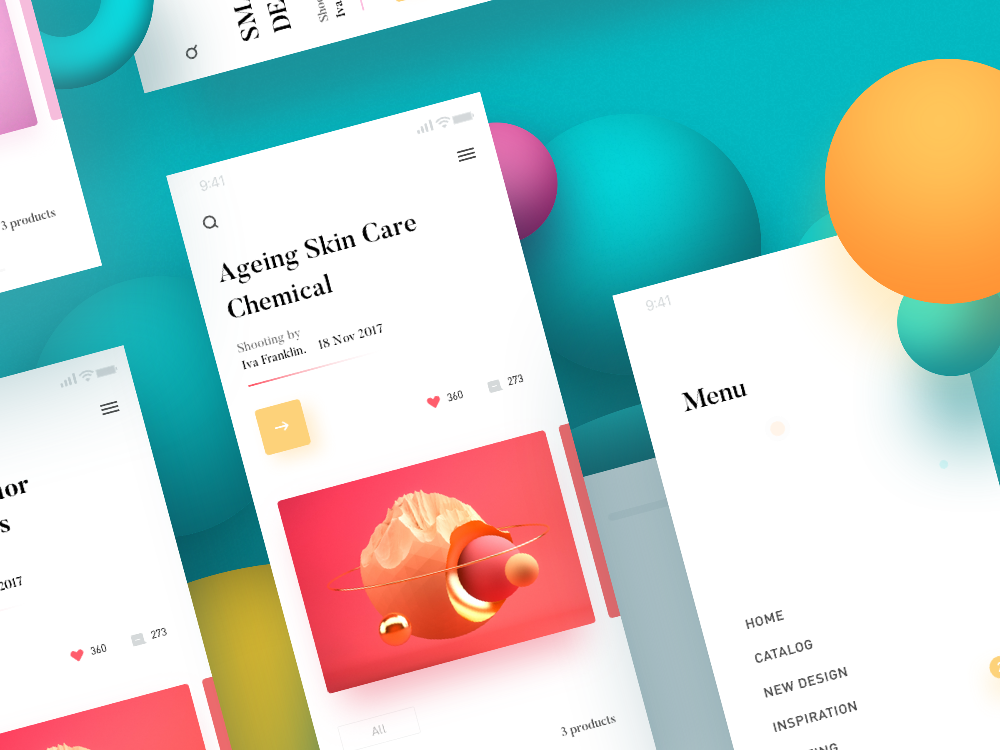
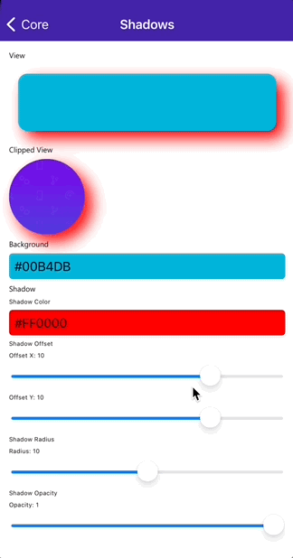

# Sombras en .NET MAUI

La sombra es una de las formas en que un usuario percibe la elevación. Este efecto de elevación transmite en qué debe centrarse el usuario. Y esta es la razón por la que los diseñadores móviles prefieren incorporar sombras en sus diseños. 

Con la llegada de la Preview 9 de .NET MAUI obtenemos novedades a nivel de UI como el nuevo control Border o una nueva API para poder crear sombras. En este artículo, vamos a centrarnos en conocer la nueva API de sombras.



## Sombras

A nivel de View, es decir, en cualquier vista disponible en .NET MAUI, se pueden añadir sombras. Esto quiere decir que se pueden añadir sombras desde en imágenes a cualquier Shape y por supuesto en un Button o Label.

Contamos con una nueva propiedad llamada **Shadow** de tipo Shadow. Shadow es un Element que cuenta con las siguientes propiedades:
- **Radius**: Es el radio del Gaussian blur usado para generar la sombra.
- **Color**: El color de la sombra.
- **Offset**: Offset de la sombra en relación al elemento visual donde se adjunta la misma.
- **Opacity**: La opacidad de la sombra.

La forma más sencilla de añadir una sombra es:

```
<Label Text="Label">
    <Label.Shadow>
        <Shadow 
            Color="Blue"
            Offset="10, 20"
            Offset="0.5"
            Radius="12">
    </Label.Shadow>
</Label>
```

**NOTA:** Cada propiedad que tenemos disponible en la clase Shadow es una BindableProperty por lo tanto, podemos actualizar cada propiedad con bindings.

Podemos crear sombras como recursos compartidos y utilizar la misma sombra en diferentes elementos visuales:

```
<ContentPage.Resources>
    <ResourceDictionary>

        <Shadow x:Key="Shadow" Brush="Red" Offset="12, 12" Radius="12" />

    </ResourceDictionary>
</ContentPage.Resources>

<Ellipse HeightRequest="100" WidthRequest="100" Fill="Blue" Shadow="{StaticResource Shadow}" />
<Button Text="Button" BackgroundColor="Blue" Shadow="{StaticResource Shadow}" />
```



¿Qué te parece esta novedad en .NET MAUI?. Recuerda, puedes usar los comentarios de la entrada para dejar tu feedback.

## Más información

* .NET Blog: [Announcing .NET MAUI Preview 9](https://devblogs.microsoft.com/dotnet/announcing-net-maui-preview-9/)