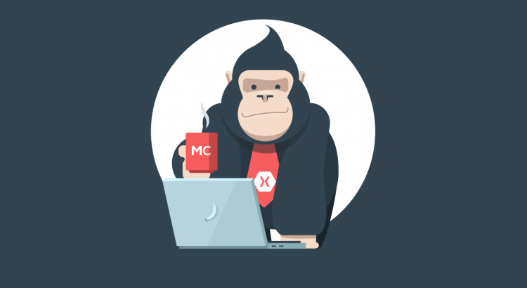

# Monkey Conf 2021

Otro año más, y otra edición de la **Monkey Conf** nueva. Este ao es ya la cuarta edición. Hablamos del mayor evento centrado en desarrollo multiplataforma con C# realizado en España. Una fecha especial para reunir a la comunidad, disfrutar de sesiones técnicas, networking y compartir momentos entre todos.

Este año, al igual que el año pasado, debido a la situación con el Covid-19, el formato será online.

## La fecha

Este año el evento tendrá lugar entre semana el próximo **Miércoles 01 de Diciembre**.

De igual forma, al ser el evento online y aunque contar con entradas nos ayudaría a conocer de forma aproximada el interés en el evento, este año no tendremos entradas.

## Call 4 Papers

¿Has desarrollado una aplicación con Xamarin?, ¿quieres hablar de .NET MAUI?, ¿Apps en Linux con Avalonia?. El [Call 4 Papers](https://sessionize.com/monkeyconf2021) del evento ya se encuentra disponible. Este año al ser un evento online nos abre la posibilidad de tener speakers de cualquier lugar del mundo!.

## Sponsors

En años anteriores, gracias a sponsors cubríamos costes básicos del evento como goodies (pegatinas, camisetas, etc.), el almuerzo, etc. Este año el evento es online, y seguimos buscando Sponsors.

_¿Por qué?_.

Creemos que estamos viviendo momentos complicados para todos, y pensamos que gracias a sponsors podríamos sortear y regalar licencias de productos relacionados con el desarrollo, etc. Buscamos tener un pequeño gesto que ayude a alegrar el día a asistentes y esto sería posible gracias a la ayuda de Sponsors.

Si estas interesado en patrocinar el evento, puedes encontrar más información en la página web del evento.

## Más información

- [Monkey Conf 2021](http://www.monkeyconf.es)